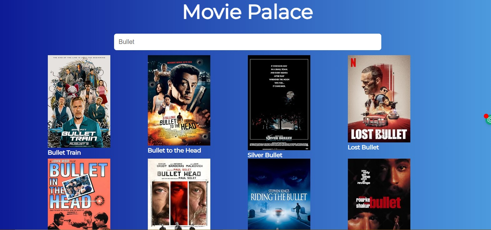
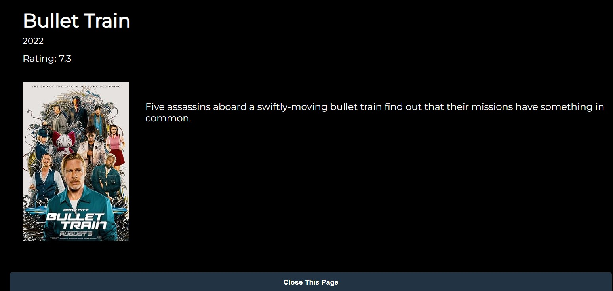

# Movie Palace

Movie Palace is a React application built with Vite that allows users to search for movies and view detailed information about them using the OMDB API.

## Features

- Search for movies by title
- View a list of search results with movie posters and titles
- Click on a movie to see detailed information
- Responsive and user-friendly interface

## Getting Started

### Prerequisites

- Node.js and npm installed on your machine

### Installation

1. Clone the repository
2. Navigate to the project directory
3. Install dependencies:

```bash
npm install
```

### Running the App

To start the development server with hot module replacement:

```bash
npm run dev
```

To build the app for production:

```bash
npm run build
```

To preview the production build locally:

```bash
npm run preview
```

## Technologies Used

- React 19
- Vite
- Axios for HTTP requests
- OMDB API for movie data

## Resources

- [OMDB API](https://www.omdbapi.com/)
- [Vite](https://vitejs.dev/)
- [React](https://reactjs.org/)

## Images





## License

This project is private and not licensed for public use.
